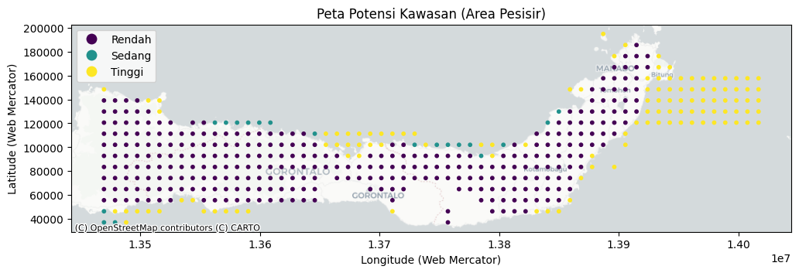

<!DOCTYPE html>
<html lang="en">
<head>
    <meta charset="UTF-8">
    <meta name="viewport" content="width=device-width, initial-scale=1.0">
</head>
<body>

<header>
    <h1 align="center">⛏️ Mithril Miner: Penambangan Data untuk Eksplorasi Lokasi Strategis PLTPs</h1>

<b>Data Mining Approach for Achieving Energy Sovereignty</b>

Implementation of Machine Learning for Strategic Tidal Power Plant (PLTPs) Site Exploration in North Sulawesi.

  

---

## 🧩 Project Summary

**CND Mithril Miner** is a geospatial data analysis project that successfully became a **Preliminary Round Delegate in the GEMASTIK XVIII 2025 National Data Mining Competition**. This project focuses on developing an identification system for strategic Tidal Power Plant (PLTPs) sites in North Sulawesi to support national energy sovereignty. By integrating oceanographic and infrastructure data, the system provides accurate, evidence-based mapping of renewable energy potential.

---

## 🏗 Technical Methodology

The system follows the industry-standard CRISP-DM (Cross-Industry Standard Process for Data Mining) framework, ranging from business understanding to model evaluation.

### 📊 Datasets Used
| Data Name | Source | Key Variables | Role |
|----------|-------|----------------|-------|
| Tidal Current Velocity | Copernicus Marine Service | utide, vtide | Primary Predictor | 
| Bathymetry | BIG (Batnas) | depth | Technical Constraint Predictor |
| Tides | BMKG | EST | Predictor & Validation |
| Distance to Grid | Manual Processing (Grid) | Lat G, Long G | Economic Constraint Predictor |
---

## 👤 **My Contributions**

My primary focus in this project was ensuring data integrity and transforming raw variables into meaningful features for the predictive model.

### 🔹 **1. Exploratory Data Analysis (EDA)**
- **Data Quality Analysis:** Identified and handled 1,223,109 missing values in current components using zero-imputation techniques (based on technical assumptions of zero current at specific points).
- **Data Cleaning:** Removed duplicate data in the Likupang observation dataset to maintain statistical validity.
- **Outlier Detection:** Analyzed extreme values in tidal range using box plots. Based on domain verification, extreme data were retained as they represent natural physical phenomena (spring tides).
- **Phenomena Characterization:** Confirmed that the tidal pattern in the study location is the Mixed, Prevailing Semidiurnal type.

### 🔹 **2. Data Preparation & Feature Engineering**
- **Raster-to-Tabular Conversion:** Extracted spatial data from .tif (Bathymetry) and .nc (Copernicus) formats into tabular structures using `rasterio` and `xarray`. 
- **Magnitude Vector:** Calculated the total current speed ($max\_tidal\_speed$) from the $u$ and $v$ vector components.
- **Spatial Merging:** Performed multi-dimensional data integration using Nearest Neighbor Join techniques based on geographic coordinates (Latitude/Longitude).
- **Target Labeling (Energy Score):** Designed categorical target variables using a scoring system that combines technical potential (current speed) and economic constraints (distance to the power grid).
  
---

## 🧠 Modeling & Evaluation
This project compared several algorithms, where XGBoost was selected as the best-performing model:

| Metric | Random Forest | XGBoost |
|------|-------------|--------|
| Accuracy | 0.9696 | 0.9797 |
| F1-Score | 0.9697 | 0.9797 |
| Kappa Score | 0.9545 | 0.9696 |

## 🗺️ Output : Peta Potensi Kawasan

  

## 📂 Folder Structure  
📦 Geothermal-Data-Analysis-  
 ┣ 📂 notebooks/ (EDA, Data Cleaning, & Modeling)  
 ┣ 📂 docs/ (Technical Report PDF)  
 ┣ 📂 dataset/  
 ┣ 📂 assets/ (Map Visualizations & Graphics)  
 ┣ README.md  
 ┗ requirements.txt

## 👥 CND Mithril Miner Team
- Christian Andreas Roeroe
- Natalio Michael Tumuahi
- David Evan Efraim Haniko

Supervisor: Daniel Febrian Sengkey, S.T., M.Eng  
Sam Ratulangi University - Informatics Engineering

## 📜 Academic Disclaimer
This project was developed by the **CND Mithril Miner** team as an innovative solution for **GEMASTIK XVIII 2025**. Analysis results recommend Bitung, Lembeh Strait, and Likupang as high-priority zones for PLTPs development.

## 📬 Contact
If you would like to discuss this project or recruit me, please contact:
nataliotumuahi@gmail.com

</body>
</html>
